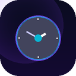

# SynActivity — Smart Web Time Tracker

<div align="center">



**Track actual time spent on websites. 100% local. Zero cloud. Zero data leaks.**

[](https://chromewebstore.google.com)
[](LICENSE)
[](manifest.json)
[](manifest.json)

</div>

---

## Why SynActivity?

Most time trackers (RescueTime, Toggl Track, Clockify) send your browsing data to their servers. **SynActivity doesn't.** Every byte of your data stays in your browser's local storage, under your control.

| Feature | SynActivity | Most alternatives |
|---|---|---|
| Data stays local | ✅ | ❌ |
| Idle detection | ✅ | Partial |
| Focus detection | ✅ | Partial |
| Free forever | ✅ | Freemium |
| No account needed | ✅ | ❌ |
| Open source | ✅ | ❌ |

---

## What Counts as "Active Time"?

SynActivity only counts time when **all three** conditions are true:

```
✅ Chrome window is focused (not minimized, not another app)
✅ The tab is the active tab (not a background tab)
✅ You are not idle (keyboard/mouse activity within the last 60 seconds)
```

This means a YouTube tab open for 5 hours doesn't count as 5 hours — only the time you were actually watching.

---

## Features

### 📊 Dashboard
- **Today / This Week / This Month** views
- **Bar chart** — top 10 sites by time (animated)
- **Donut chart** — breakdown by category
- **Trend chart** — daily usage over 7 or 30 days
- **Sortable table** — all sites with time, visits, and last-seen
- **Search & filter** by domain or category

### 🏷️ Auto-Categories
Sites are automatically grouped into: `Social` · `Development` · `Entertainment` · `Productivity` · `Search` · `AI` · `News` · `Other`

You can add custom categories for any domain in Settings.

### ⚙️ Settings
- Idle timeout (15s – 300s, default 60s)
- Custom domain → category mapping
- Pause/resume tracking
- Export all data as JSON
- Clear all data

### 🔒 Security
- **Zero network requests** — no `fetch()`, no CDN, no telemetry
- **No `host_permissions`** — the extension never injects into pages
- **Strict CSP** with `connect-src 'none'`
- Data stored in `chrome.storage.local` (sandboxed to extension only)

---

## Install from Source

1. Clone this repo:
   ```bash
   git clone https://github.com/iamsayanmandal/SynActivity.git
   cd SynActivity
   ```

2. Open Chrome → `chrome://extensions`

3. Enable **Developer Mode** (toggle, top-right)

4. Click **"Load unpacked"** → select the `SynActivity` folder

5. The clock icon appears in your toolbar ✅

### Regenerate Icons (optional)
```bash
pip3 install Pillow
python3 generate-icons.py
```

---

## Data Storage Format

All data lives in `chrome.storage.local`:

```json
{
  "day_2025-01-15": {
    "github.com": {
      "totalSeconds": 3720,
      "visits": 8,
      "firstVisit": 1736924400000,
      "lastVisit":  1736946000000,
      "category": "Development"
    },
    "youtube.com": { "..." }
  }
}
```

Export your data anytime from the Dashboard → Settings → **Export JSON**.

---

## Privacy Policy

See [PRIVACY.md](PRIVACY.md).

**Short version:** SynActivity collects no personal data, makes no network requests, and stores everything locally in your browser. No account, no cloud, no tracking of the tracker.

---

## Contributing

Pull requests are welcome! Please open an issue first to discuss major changes.

1. Fork the repo
2. Create a feature branch (`git checkout -b feature/my-feature`)
3. Commit your changes
4. Push and open a Pull Request

---

## Author

**Sayan Mandal** — [@iamsayanmandal](https://github.com/iamsayanmandal)

---

## License

[Apache License 2.0](LICENSE) © 2025 Sayan Mandal
